# Architecture

## System Overview

Travs has three main runtime surfaces:

1. Android tourist app
2. Laravel admin portal and API
3. Automated destination collection pipeline

The mobile app reads from a local SQLite database first. Network synchronization runs in the background and updates the local store when connectivity is available. User-generated data such as reviews, favorites, itineraries, profile edits, and pending ratings are queued locally and pushed to the API through a sync worker.

The admin portal owns moderation and publishing. Automated imports are never published directly. Imported destinations enter a review queue where admins can approve, reject, edit, or merge records.

## Mobile Architecture

Pattern: MVVM

Layers:

- `ui`: Jetpack Compose screens, navigation, theming
- `viewmodel`: UI state, events, and orchestration
- `data.local`: SQLite entities and DAOs
- `data.remote`: API DTOs and service interfaces
- `data.repository`: offline-first source of truth coordination
- `sync`: background upload/download synchronization
- `location`: GPS, geofencing, and routing support

Source of truth:

- SQLite is the primary read source.
- Remote API is used to refresh local data and resolve pending sync operations.
- Images are loaded with Coil and cached by the image loader.

## Admin Architecture

Backend:

- Laravel controllers expose Inertia pages and JSON APIs.
- Eloquent models represent users, destinations, categories, municipalities, images, reviews, imports, and sync records.
- Policies and gates enforce role-based access.
- Queue jobs run crawls, extraction, AI enrichment, duplicate detection, and periodic refresh checks.

Frontend:

- React pages are served through Inertia.
- Tailwind provides the admin design system.
- Admin views are organized by operational workflow rather than raw database tables.

## Data Flow

```mermaid
flowchart LR
    Sources["Trusted public sources"] --> Crawler["Crawler jobs"]
    Crawler --> Extractor["Extraction and normalization"]
    Extractor --> AI["AI summary, category, quality checks"]
    AI --> Dedupe["Duplicate detection"]
    Dedupe --> Queue["Import review queue"]
    Queue --> Admin["Admin approve/edit/reject"]
    Admin --> API["Laravel API"]
    API --> MobileSync["Mobile sync worker"]
    MobileSync --> SQLite["SQLite local cache"]
    SQLite --> UI["Tourist app UI"]
```

## Map Provider

Use an OpenStreetMap-compatible provider for map tiles and routing. Keep provider keys and endpoints in environment configuration so the implementation can support providers such as Mapbox, GraphHopper, OpenRouteService, or a self-hosted stack.

## Offline Behavior

- Destination lists, details, categories, municipalities, favorites, and itineraries must render without internet.
- Reviews and ratings created offline are written to a pending sync table.
- Conflicts are resolved server-side using updated timestamps and record versions.
- Admin-published changes are pulled by `updated_at` cursor.

## Security

- Mobile API uses token authentication.
- Admin portal uses Laravel session auth and role-based permissions.
- Scraped content is stored with source attribution.
- Imported images should be downloaded, scanned, resized, and served from application-owned storage after approval.
